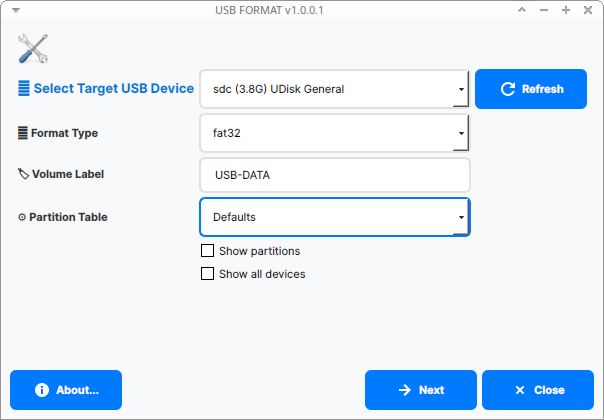

# FORMAT USB TEAM

[](https://www.gnu.org/licenses/gpl-3.0)
[](https://github.com/WHO-AM-I-404/usb-formatter-pro)

**USB Formatter Pro** is a modern, cross-platform graphical tool for formatting USB drives and removable storage devices on Linux. Built with Qt5/6, it provides an intuitive interface for safely formatting USB drives with various filesystem options.



## ✨ Features

- **Modern GUI Interface**: Clean, contemporary design built with Qt
- **Multiple Filesystem Support**: 
  - FAT32 (Windows/Mac/Linux compatible)
  - NTFS (Windows native)
  - ext4 (Linux native)
  - exFAT (Cross-platform large file support)
- **Automatic Device Detection**: Safely detects removable USB devices
- **Partition Table Options**: Support for GPT, MBR/MSDOS, and default partitioning
- **Cross-Platform Compatibility**: Works on Debian, Ubuntu, and other Linux distributions
- **Safety Features**: Built-in checks to prevent formatting of system drives
- **Custom Volume Labels**: Set custom names for your formatted drives

## 🖥️ System Requirements

### Supported Operating Systems
- **Ubuntu** 18.04 LTS and newer
- **Debian** 9 (Stretch) and newer
- **Linux Mint** 19 and newer
- **Elementary OS** 5.0 and newer
- **Other Debian-based distributions**

### Dependencies
- Qt5 Core, GUI, and Widgets (≥ 5.9)
- Standard Linux utilities: `parted`, `mkfs`, `lsblk`
- Root privileges for device formatting operations

## 📦 Installation

### Building from Source

#### 1. Install Dependencies

**On Ubuntu/Debian:**
```bash
sudo apt update
sudo apt install -y build-essential qtbase5-dev qtchooser qt5-qmake qtbase5-dev-tools
sudo apt install -y parted dosfstools ntfs-3g exfat-utils e2fsprogs
```

**On older systems, you might need:**
```bash
sudo apt install -y exfat-fuse exfat-utils
```

#### 2. Clone and Build

```bash
# Clone the repository
git clone https://github.com/WHO-AM-I-404/formatusb.git
cd formatusb

# Generate Makefile
qmake

# Compile the project
make

# The executable 'formatusb' will be created in the project directory
```

#### 3. Install System-Wide (Optional)

```bash
# Copy binary to system path
sudo cp formatusb /usr/local/bin/

# Make library accessible
sudo mkdir -p /usr/lib/formatusb/
sudo cp lib/formatusb_lib /usr/lib/formatusb/

# Create desktop entry
sudo tee /usr/share/applications/formatsub.desktop << EOF
[Desktop Entry]
Name=FORMAT USB
Comment=Format USB drives and removable storage devices
Exec=formatusb
Icon=drive-removable-media-usb
Type=Application
Categories=System;Utility;
Keywords=USB;format;drive;storage;disk;
EOF

# Update desktop database
sudo update-desktop-database
```

## 🚀 Usage

### Running the Application

**From Source Directory:**
```bash
./formatusb
```

**If Installed System-Wide:**
```bash
formatsub
```

**Or find it in your applications menu under System Tools**

### Step-by-Step Formatting Guide

1. **Launch USB Formatter Pro**
   - Insert your USB drive
   - Launch the application (requires root privileges for formatting)

2. **Select Target Device**
   - Choose your USB device from the dropdown menu
   - Use "Show all devices" to see all connected storage (⚠️ **Use with caution**)
   - Use "Show partitions" to view individual partitions

3. **Choose Filesystem Format**
   - **FAT32**: Best for compatibility (Windows, Mac, Linux)
   - **NTFS**: Best for large files and Windows systems
   - **ext4**: Best for Linux-only usage
   - **exFAT**: Best for large files with cross-platform support

4. **Set Partition Options**
   - **Defaults**: Let the system choose optimal settings
   - **MBR/msdos**: Compatible with older systems
   - **GPT**: Modern partition table (recommended for drives > 2TB)

5. **Customize Volume Label**
   - Enter a custom name for your USB drive
   - Use alphanumeric characters (avoid special characters)

6. **Format the Drive**
   - Click "Next" to proceed
   - Confirm the operation in the dialog
   - Wait for the formatting process to complete

## ⚠️ Important Safety Information

- **Data Loss Warning**: Formatting will permanently erase all data on the selected drive
- **Always backup important data** before formatting
- **Double-check device selection** to avoid formatting the wrong drive
- **Never format system drives** - the application includes safeguards, but always verify
- **Safely eject** the drive after formatting is complete

## 🛠️ Troubleshooting

### Common Issues

**Permission Denied Errors:**
```bash
# Ensure you're running with sufficient privileges
sudo ./formatusb
```

**Qt Library Not Found:**
```bash
# Install Qt development packages
sudo apt install qtbase5-dev
```

**Device Not Detected:**
- Ensure the USB drive is properly connected
- Try a different USB port
- Check if the device is mounted: `lsblk`
- Enable "Show all devices" option (use carefully)

**Formatting Fails:**
- Ensure the device is not mounted elsewhere
- Check device permissions: `ls -la /dev/sd*`
- Verify filesystem tools are installed (`dosfstools`, `ntfs-3g`, etc.)

### Log Files

Application logs are stored in `/tmp/formatter.log` for debugging purposes.

## 🔧 Development

### Project Structure

```
usb-formatter-pro/
├── src.pro              # Qt project file
├── main.cpp             # Application entry point
├── mainwindow.cpp/h     # Main interface logic
├── mainwindow.ui        # Qt Designer UI file
├── cmd.cpp/h            # Command execution utilities
├── about.cpp/h          # About dialog
├── version.h            # Version information
├── lib/
│   └── formatusb_lib    # Core formatting library (Bash)
├── images/
│   └── logo.svg         # Application icon
├── translations/        # Internationalization files
└── debian/             # Debian packaging files
```

### Contributing

1. Fork the repository
2. Create a feature branch: `git checkout -b feature-name`
3. Make your changes
4. Test thoroughly on different distributions
5. Commit with clear messages: `git commit -m 'Add feature description'`
6. Push to your fork: `git push origin feature-name`
7. Create a Pull Request

### Coding Standards

- Follow Qt coding conventions
- Use modern C++17/20 features where appropriate
- Ensure cross-platform compatibility
- Add proper error handling
- Document complex functions
- Test on multiple Linux distributions

## 📋 Technical Details

### Supported Filesystems

| Filesystem | Max File Size | Max Volume Size | Compatibility | Use Case |
|------------|---------------|-----------------|---------------|----------|
| FAT32      | 4 GB          | 2 TB            | Universal     | General purpose |
| NTFS       | 16 TB         | 256 TB          | Windows/Linux | Large files |
| ext4       | 16 TB         | 1 EB            | Linux         | Linux native |
| exFAT      | 16 EB         | 128 PB          | Modern systems| Large files, cross-platform |

### System Integration

- Uses `polkit` for privilege escalation when available
- Falls back to `gksu` or `sudo` as needed
- Integrates with desktop environments through `.desktop` files
- Follows XDG desktop standards

## 📜 License

This project is licensed under the GNU General Public License v3.0 - see the [LICENSE](LICENSE) file for details.

## 👥 Authors & Contributors

- **WHO-AM-I-404** - *Project Maintainer & Lead Developer*
- **Original MX Linux Team** - *Initial FormatUSB implementation*

## 🙏 Acknowledgments

- Original FormatUSB project by MX Linux team
- James Bowlin (BitJam) for live-usb-maker utilities
- Qt Framework for the excellent GUI toolkit
- The Linux community for testing and feedback

## 🐛 Bug Reports & Feature Requests

Please report bugs and request features through the [GitHub Issues](https://github.com/WHO-AM-I-404/formatusb/issues) page.

When reporting bugs, please include:
- Your Linux distribution and version
- Qt version (`qmake --version`)
- Steps to reproduce the issue
- Application log output
- Screenshots if applicable

**Made with ❤️ for the Linux community**

For more information, visit: [GitHub Repository](https://github.com/WHO-AM-I-404/formatusb)
